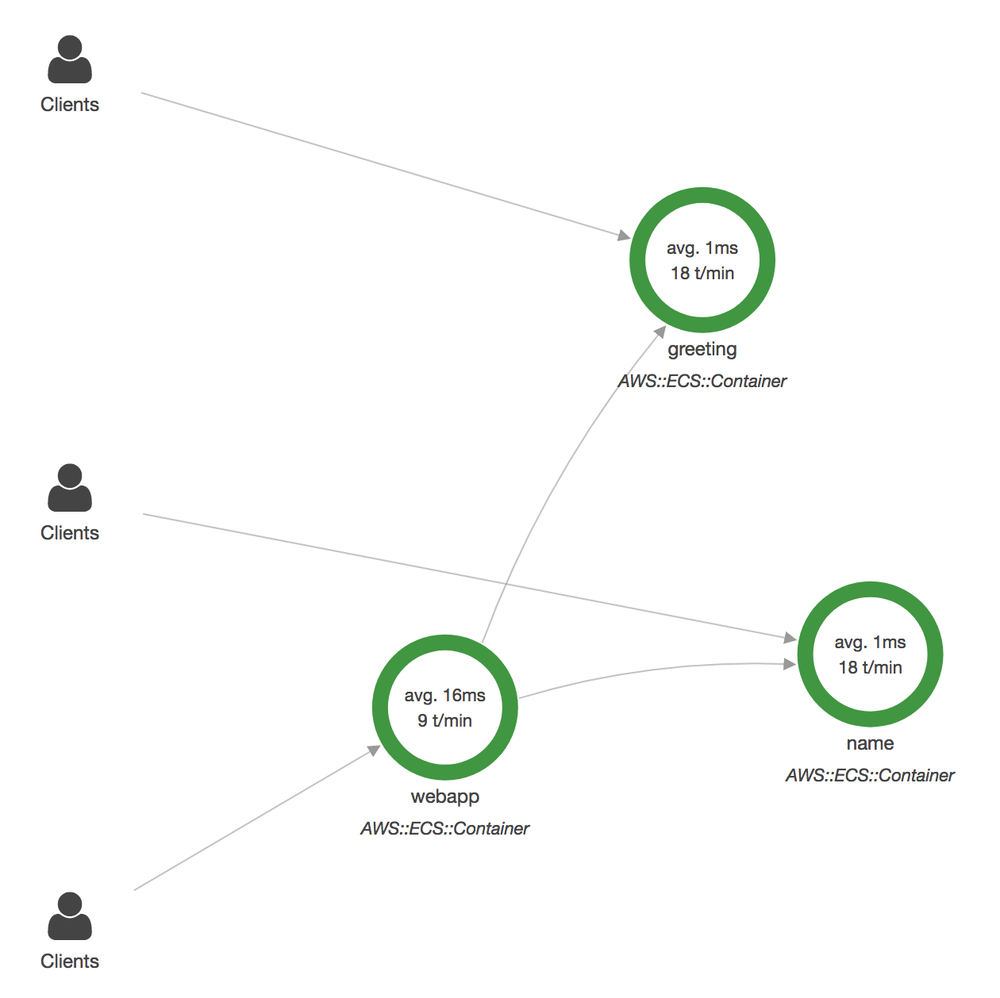
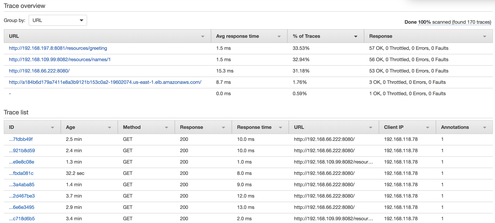

# Distributed Debugging for Kubernetes and Serverless Applications using AWS X-Ray

This repo explains how AWS X-Ray can be used for distributed debugging in Kubernetes and Serverless applications.

## Application

The application consists of three microservices: `webapp`, `greeting`, and `name`. The `webapp` microservice calls `greeting` and `name` microservice to create a message and return the response.

- Each microservice is in a different repo:

	Service | Link
	------- | ----
	`greeting` | https://github.com/arun-gupta/microservices-greeting
	`name` | https://github.com/arun-gupta/microservices-name
	`webapp` | https://github.com/arun-gupta/microservices-webapp

- Clone all the repos
- Create Docker image and push them to a registry for each repo. By default, the images are generated with `arungupta` repo and `latest` tag. Helm charts used for deploying the application use `xray` tag. These images can be created and pushed using the following command:

	```
	mvn install -Pdocker -Ddocker.tag=xray
	```

	The images can be created in a different repo as:

	```
	mvn install -Pdocker -Ddocker.repo=<repo> -Ddocker.tag=xray
	```

## Create Kubernetes Cluster

Use [Amazon Elastic Container Service for Kubernetes](https://aws.amazon.com/eks/) to create a fully managed Kubernetes cluster.

The cluster can be created in any of the following ways.

### EKS Getting Started

- Follow the steps outlined at [Getting Started with EKS](https://docs.aws.amazon.com/eks/latest/userguide/getting-started.html) to create your EKS cluster.

### eksctl CLI

- Use [eksctl](https://eksctl.io) CLI to simplify the steps necessary to create your culuster. Install `eksctl` on your machine and create a 2 node cluster in `us-east-1` region:

	```
	eksctl create cluster \
		--name myeks \
		--region us-east-1 \
		--zones us-east-1a,us-east-1b,us-east-1d
	```

	See the documentation for all setup options.

- Download Heptio Authenticator AWS:

	```
	curl -o heptio-authenticator-aws \
		-L \
		https://github.com/kubernetes-sigs/aws-iam-authenticator/releases/download/v0.3.0/heptio-authenticator-aws_0.3.0_darwin_amd64
	chmod +x heptio-authenticator-aws
	```

- Check the nodes:

	```
	$ kubectl get nodes
	NAME                             STATUS    ROLES     AGE       VERSION
	ip-192-168-118-78.ec2.internal   Ready     <none>    37m       v1.10.3
	ip-192-168-194-4.ec2.internal    Ready     <none>    37m       v1.10.3
	```

## Setup X-Ray in Kubernetes

- `arungupta/xray:latest` Docker image is already available on Docker Hub. Optionally, you may build the image:

	```
	cd config/xray
	docker image build -t arungupta/xray:latest .
	docker image push arungupta/xray:latest
	```
- Ensure your Kubernetes worker nodes have the IAM permissions to write trace data to the X-Ray service. Add the `AWSXrayWriteOnlyAccess` policy to the EC2 Instance role of your EKS worker nodes in IAM.

- Deploy the DaemonSet: `kubectl apply -f xray-daemonset.yaml`

## Deploy the Application

- Install Helm:

	```
	brew install kubernetes-helm
	kubectl -n kube-system create sa tiller
	kubectl create clusterrolebinding tiller --clusterrole cluster-admin --serviceaccount=kube-system:tiller
	helm init --service-account tiller
	```

- Deploy the application:

	```
	helm install --name myapp myapp
	```

	The application is configured to use `arungupta/<service>:xray`. Make sure to update the value in `myapp/values.yaml` to match your repo and tag.

- Access the application:

	```
	curl http://$(kubectl get svc/myapp-webapp -o jsonpath='{.status.loadBalancer.ingress[0].hostname}')
	```

- Open [X-Ray console](https://console.aws.amazon.com/xray/home?region=us-east-1#/service-map) and watch the service map and traces.

### X-Ray Service Map



### X-Ray Traces




## License Summary

This sample code is made available under a modified MIT license. See the LICENSE file.
